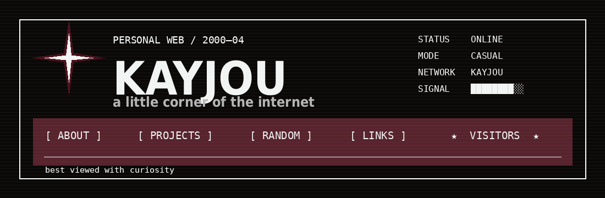

# ✦ KAYJOU

<p align="center">
  
</p>

<p align="center">
  
  
</p>

> **a little corner of the internet**  
> computer engineering · AI experiments · games · random projects

---

### ✦ ABOUT / 01

```text
USER      KAYJOU
STATUS    ONLINE
MODE      CASUAL
SIGNAL    ████████░░
```

I like building things, breaking things, and seeing what happens when the two
meet. This page is deliberately closer to a personal web page than a portfolio.

---

### ✦ PROJECTS / 02

**MINECRAFT AI COMPANION**  
AI + Minecraft experiment.

`[ EXPERIMENTAL ]`

**LOCAL AI / TTS**  
Playing with local models, voice, automation and assistant ideas.

`[ IN PROGRESS ]`

**RANDOM LAB**  
Small scripts, prototypes and things that started with “wait, can I make this?”

`[ ALWAYS OPEN ]`

---

### ✦ TOOLBOX / 03

`JavaScript` · `Python` · `Node.js` · `AI` · `TTS` · `Minecraft` · `Automation`

---

### ✦ LINKS / 04

[ GITHUB ](https://github.com/Real-Kayjou) · [ PROJECTS ](https://github.com/Real-Kayjou?tab=repositories)

---

<p align="center">
  
  
  
  
</p>

<p align="center">
  <sub>✦ made by KAYJOU · 2026 · still messing with the internet ✦</sub>
</p>
